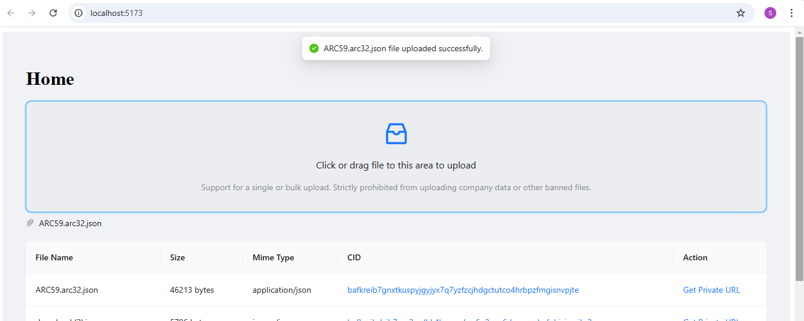
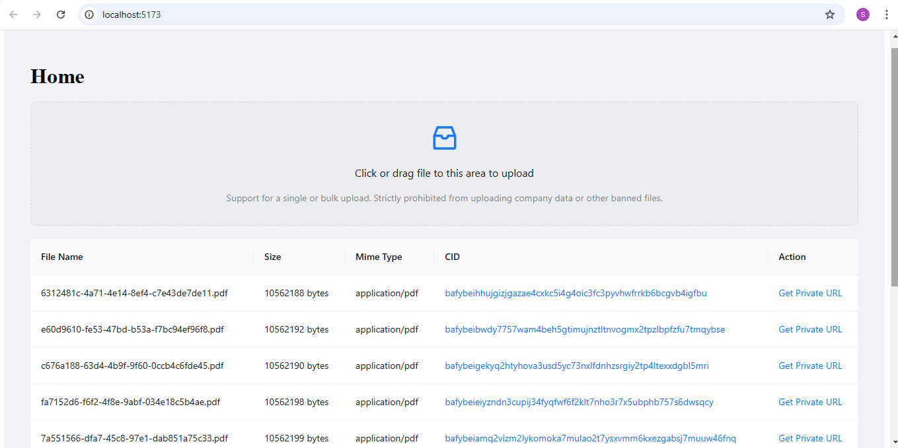

# Private IPFS File Storage

A web application that demonstrates private file storage using IPFS (InterPlanetary File System) with Pinata's private gateway feature.

## Features

- Upload files to IPFS through Pinata
- List all uploaded files
- Generate time-limited private access URLs
- View files through private access URLs
- Support for multiple file uploads
- File metadata display (name, size, MIME type)

## Tech Stack

- Frontend:
  - React
  - TypeScript
  - Ant Design Components
  - React Router

- Backend:
  - Node.js
  - Express
  - TypeScript
  - Pinata SDK

## Prerequisites

- Node.js (v20 or higher)
- NPM or Yarn
- Pinata Account with API credentials

## Setup

1. Clone the repository
```bash
git clone https://github.com/SatishGAXL/private-ipfs.git
cd private-ipfs
```

2. Install dependencies:
```bash
# Install frontend dependencies
cd frontend
npm install

# Install backend dependencies
cd ../backend
npm install
```

3. Configure environment variables:
   - Create a `.env` file in the backend directory
   - Add your Pinata credentials:
```env
PINATA_JWT=your_pinata_jwt_token
PINATA_GATEWAY=your_pinata_gateway_url
```

4. Start the development servers:
```bash
# Start frontend (in frontend directory)
npm run dev

# Start backend (in backend directory)
npm run dev
```

Alternatively, use the provided `run.bat` script to start both servers simultaneously.

## How It Works

1. **File Upload**
   - Files are uploaded through a drag-and-drop interface
   - Backend receives files and uploads them to IPFS via Pinata
   - Files are stored privately on IPFS

   

2. **File Access**
   - Files can be accessed using:
     - Private temporary URLs generated through Pinata SDK
     
    

3. **Private URLs**
   - Generate time-limited access URLs (default: 10 seconds)
   - URLs expire after the specified duration
   - Ensures secure and controlled file access

## Security Features

- Private file storage on IPFS
- Temporary access URLs
- Files are immediately removed from server after upload
- CORS enabled for API security

## API Endpoints

- `GET /get-files` - List all uploaded files
- `POST /upload-file` - Upload new file
- `GET /get-private-url/:cid` - Generate private access URL

## Notes

- The private gateway feature is a feature of Pinata not IPFS
- File access URLs are temporary and expire after the configured duration
- Always keep your Pinata credentials secure